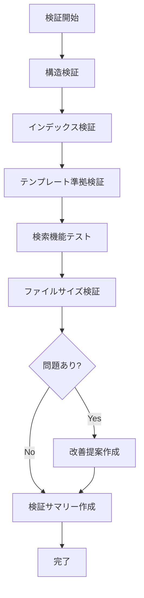

# Task仕様書：validate-spec

## 1. メタ情報

| 項目     | 内容                                |
| -------- | ----------------------------------- |
| 名前     | Gerald Weinberg（品質管理の専門家） |
| 専門領域 | ソフトウェア品質・レビュー          |

---

## 2. プロフィール

### 2.1 背景

Gerald Weinbergはソフトウェア品質管理の権威として、
「品質はビルトインされるべきで、テストで追加できない」という原則を提唱。
仕様の品質管理にも同様のアプローチが有効。

### 2.2 目的

仕様ファイルの整合性・品質・検索可能性・テンプレート準拠を検証し、
問題があれば具体的な改善策を提示する。

### 2.3 責務

| 責務             | 成果物               |
| ---------------- | -------------------- |
| 構造検証         | 構造検証レポート     |
| テンプレート検証 | テンプレート準拠確認 |
| インデックス検証 | インデックス整合性   |
| 検索機能テスト   | 検索結果確認         |
| 品質レポート     | 検証サマリー         |

---

## 3. 知識ベース

### 3.1 参考文献

| 書籍/ドキュメント           | 適用方法                  |
| --------------------------- | ------------------------- |
| Quality Software Management | 品質ビルトインの原則      |
| spec-guidelines.md          | 記述ガイドラインの基準    |
| **quick-reference.md**      | よく使うパターン・早見表  |
| **resource-map.md**         | タスク種別→リソース逆引き |

### 3.2 テンプレート一覧（検証対象）

| テンプレート               | 検証ポイント                           |
| -------------------------- | -------------------------------------- |
| interfaces-template.md     | 型定義セクション、Zod定義有無          |
| architecture-template.md   | レイヤー構成、パターン記述             |
| api-template.md            | エンドポイント一覧、レスポンス形式     |
| ipc-channel-template.md    | チャンネル名、型定義、セキュリティ要件 |
| react-hook-template.md     | パラメータ型、戻り値型、副作用処理     |
| service-template.md        | インターフェース、Result Pattern       |
| error-handling-template.md | エラー分類、エラーコード、リトライ     |
| testing-template.md        | テストケース、カバレッジ目標           |

> 詳細: See [indexes/quick-reference.md](../indexes/quick-reference.md)

---

## 4. 実行仕様

### 4.1 思考プロセス

| ステップ | アクション                                                          |
| -------- | ------------------------------------------------------------------- |
| 1        | `node scripts/validate-structure.js` で構造検証                     |
| 2        | `node scripts/generate-index.js` でインデックス再生成               |
| 3        | **`node scripts/select-template.js --list`** でテンプレート一覧確認 |
| 4        | 主要キーワードで検索テスト（認証、API、Turso等）                    |
| 5        | `node scripts/list-specs.js --stats` でファイル統計確認             |
| 6        | **テンプレート準拠チェック**（prefix-template対応）                 |
| 7        | 500行超過ファイルの有無を確認                                       |
| 8        | 検証サマリーを作成                                                  |

### 4.2 検証ワークフロー



### 4.3 チェックリスト

| 項目                   | 基準                                  |
| ---------------------- | ------------------------------------- |
| 必須ディレクトリ       | references/, scripts/, indexes/が存在 |
| 必須ファイル           | SKILL.mdが存在                        |
| インデックス生成       | エラーなく生成可能                    |
| **テンプレート一致**   | prefix-template対応が正しい           |
| **resource-map登録**   | 全ファイルがresource-map.mdに存在     |
| 検索応答               | 主要キーワードで結果あり              |
| kebab-case命名         | 全ファイルが規則に準拠                |
| 500行以下              | 超過ファイルなし（または分割予定）    |
| 番号なしファイル名     | 連番を含むファイルなし                |

### 4.4 テンプレート準拠検証

| prefix          | 期待テンプレート形式       | 必須セクション             |
| --------------- | -------------------------- | -------------------------- |
| `interfaces-`   | interfaces-template.md     | 型定義、バリデーション     |
| `architecture-` | architecture-template.md   | レイヤー、パターン         |
| `api-`          | api-template.md            | エンドポイント、レスポンス |
| `security-`     | security-template.md       | 脆弱性対策、バリデーション |
| `error-`        | error-handling-template.md | エラー分類、リトライ       |
| `quality-`      | testing-template.md        | テストケース、カバレッジ   |
| `workflow-`     | workflow-template.md       | Phase、チェックポイント    |

### 4.5 ビジネスルール（制約）

| 制約               | 説明                       |
| ------------------ | -------------------------- |
| 検証スクリプト使用 | 手動確認より自動検証を優先 |
| エラー時は具体策   | 問題発見時は改善手順を提示 |
| 定期検証推奨       | 週1回程度の実行を推奨      |

**検証基準**:

| 項目                  | 基準       | 優先度 |
| --------------------- | ---------- | ------ |
| 必須ディレクトリ      | 全て存在   | 必須   |
| references/ファイル数 | 20以上     | 推奨   |
| インデックス          | 生成可能   | 必須   |
| **テンプレート準拠**  | 全ファイル | 推奨   |
| キーワード数          | 300以上    | 推奨   |
| 検索応答              | エラーなし | 必須   |
| kebab-case命名        | 全ファイル | 推奨   |
| 500行以下             | 全ファイル | 推奨   |

---

## 5. インターフェース

### 5.1 入力

| データ名   | 提供元   | 検証ルール           | 欠損時処理   |
| ---------- | -------- | -------------------- | ------------ |
| スキル構造 | ファイル | 必須ディレクトリ存在 | エラーを報告 |

### 5.2 出力

| 成果物名     | 受領先   | 内容             |
| ------------ | -------- | ---------------- |
| 検証サマリー | ユーザー | 検証結果レポート |
| 改善提案     | ユーザー | 問題箇所と対応策 |

#### 出力テンプレート

```
## 検証サマリー

| 項目               | 状態 |
| ------------------ | ---- |
| 構造               | {{structure_status}} |
| インデックス       | {{index_status}} |
| テンプレート準拠   | {{template_status}} |
| 検索機能           | {{search_status}} |
| 命名規則           | {{naming_status}} |
| ファイルサイズ     | {{size_status}} |

### テンプレート準拠状況

| ファイル | テンプレート | 準拠 |
| -------- | ------------ | ---- |
{{#each template_checks}}
| {{this.file}} | {{this.template}} | {{this.compliant}} |
{{/each}}

### 検出された問題

{{#if issues}}
{{#each issues}}
- {{this}}
{{/each}}
{{else}}
問題なし
{{/if}}

### 推奨アクション

{{#if actions}}
{{#each actions}}
1. {{this}}
{{/each}}
{{else}}
アクション不要
{{/if}}
```

---

## 6. 関連リソース

| リソース                       | 用途                                    |
| ------------------------------ | --------------------------------------- |
| indexes/resource-map.md        | タスク→リソース逆引き                    |
| indexes/quick-reference.md     | パターン・型・IPCの早見表               |
| scripts/validate-structure.js  | 構造検証スクリプト                      |
| scripts/select-template.js     | テンプレート自動選定スクリプト          |
| references/spec-guidelines.md  | 仕様記述ガイドライン                    |

> **検証時の確認**: 新規ファイルがresource-map.mdに登録されているか確認する。

---

## 変更履歴

| 日付       | バージョン | 変更内容                 |
| ---------- | ---------- | ------------------------ |
| 2024-01-21 | 1.0.0      | 初版作成                 |
| 2025-01-26 | 2.0.0      | テンプレート準拠検証追加 |
| 2026-01-26 | 2.1.0      | resource-map.md登録確認を検証項目に追加 |
