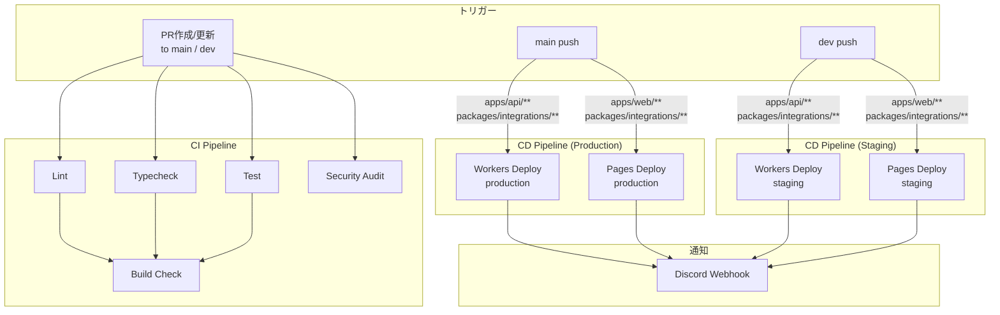

# GitHub Actions ワークフロー

このディレクトリには、プロジェクトのCI/CDワークフローが含まれています。

## ブランチ戦略

```
feature/* → dev → main
（機能開発）  （staging）  （production）
```

| ブランチ | 環境 | デプロイ先 |
| -------- | ---- | ---------- |
| `feature/*` | ローカルのみ | なし |
| `dev` | staging | Cloudflare (staging) |
| `main` | production | Cloudflare (production) |

## ワークフロー構成図



## ワークフロー一覧

### CI/CD

| ワークフロー       | トリガー                                    | 説明                                                           |
| ------------------ | ------------------------------------------- | -------------------------------------------------------------- |
| **ci.yml**         | Push/PR to `main`, `dev`                   | Lint、TypeCheck、Test、Buildの実行                             |
| **backend-ci.yml** | Push to `main`/`dev` (`apps/api/**`)        | Cloudflare Workers デプロイ（staging/production） + Discord通知 |
| **web-cd.yml**     | Push to `main`/`dev` (`apps/web/**`)        | Cloudflare Pages デプロイ（staging/production） + Discord通知  |

### メンテナンス

| ワークフロー       | トリガー             | 説明               |
| ------------------ | -------------------- | ------------------ |
| **stale.yml**      | スケジュール（日次） | 古いIssue/PRの管理 |
| **auto-label.yml** | Issue/PR作成時       | 自動ラベル付け     |

## 必要なシークレット・変数

### Secrets（機密情報）

| 名前 | 説明 | 使用ワークフロー |
| ---- | ---- | ---------------- |
| `CLOUDFLARE_API_TOKEN` | Cloudflare API Token | backend-ci.yml, web-cd.yml |
| `CLOUDFLARE_ACCOUNT_ID` | Cloudflare アカウント ID | backend-ci.yml, web-cd.yml |
| `DISCORD_WEBHOOK_URL` | Discord Webhook URL（デプロイ通知） | backend-ci.yml, web-cd.yml |
| `CODECOV_TOKEN` | Codecov トークン | ci.yml |

### Variables（非機密設定値）

| 名前 | 説明 | 使用ワークフロー |
| ---- | ---- | ---------------- |
| `CLOUDFLARE_PAGES_PROJECT` | Cloudflare Pages プロジェクト名 | web-cd.yml |
| `CLOUDFLARE_WORKERS_DOMAIN` | Workers 本番ドメイン | backend-ci.yml |
| `CLOUDFLARE_WORKERS_STAGING_DOMAIN` | Workers staging ドメイン | backend-ci.yml |

> ランタイム API キー（OpenAI, Anthropic, Slack 等）は GitHub Secrets ではなく **Cloudflare Secrets** で管理する。
> 詳細: `.claude/skills/aiworkflow-requirements/references/deployment-secrets-management.md`

## ローカル Actions テスト

```bash
# act を使ったローカルテスト
act push --secret-file .secrets.local
```
